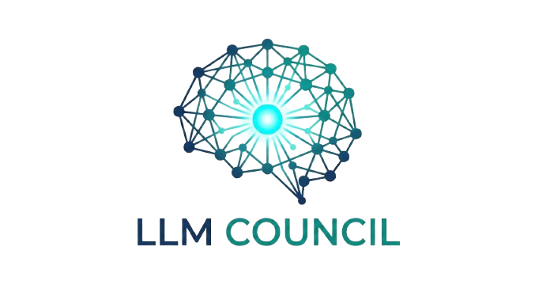

# LLM Council

A multi-agent AI deliberation platform that assembles configurable councils of AI models to provide independent reasoning, peer critique, and synthesized outcomes.



## Overview

LLM Council is built on the principle that better decisions come from structured disagreement, not single answers. The platform orchestrates multiple AI models through a four-phase deliberation process:

1. **Setup** - Configure your prompt and select council members with different roles
2. **Reasoning** - Each model generates an independent response
3. **Review** - Models critique and score each other's responses
4. **Synthesis** - A chairman model synthesizes the final answer with confidence levels

## Features

- **Multi-Model Councils** - Combine models from OpenAI, Anthropic, Google, Meta, and more
- **Role-Based Deliberation** - Assign roles like Thinker, Critic, Devil's Advocate, and Chair
- **Real-Time Updates** - Watch deliberations unfold with live streaming
- **Peer Review Matrix** - See how models evaluate each other
- **PDF Reports** - Export comprehensive deliberation reports
- **Session History** - Review and replay past deliberations
- **Dark/Light Theme** - Customizable UI preferences

## Architecture

```
┌─────────────────┐     ┌──────────────────┐     ┌──────────────────┐
│    Frontend     │────▶│     Supabase     │◀────│   Orchestrator   │
│  (React + TS)   │     │  (Auth + Data)   │     │    (FastAPI)     │
│   Port 5173     │     │   (Cloud/Local)  │     │    Port 8002     │
└─────────────────┘     └──────────────────┘     └──────────────────┘
                                                          │
                                                          ▼
                                                 ┌──────────────────┐
                                                 │   OpenRouter     │
                                                 │   (LLM API)      │
                                                 └──────────────────┘
```

## Tech Stack

### Frontend
- React 18 + TypeScript
- Vite for build tooling
- Tailwind CSS with custom theming
- Zustand for state management
- Supabase Realtime for live updates
- jsPDF for report generation

### Backend (Orchestrator)
- FastAPI (Python)
- OpenRouter for LLM access
- Supabase for data persistence

### Database
- Supabase (PostgreSQL)
- Row Level Security (RLS)
- Real-time subscriptions

## Getting Started

### Prerequisites

- Node.js 18+
- Python 3.11+
- Supabase account (or local Supabase)
- OpenRouter API key

### Environment Setup

1. **Clone the repository**
   ```bash
   git clone https://github.com/XLCSPD/llm-council-app.git
   cd llm-council-app
   ```

2. **Frontend setup**
   ```bash
   cd frontend
   cp .env.example .env
   # Edit .env with your Supabase credentials
   npm install
   npm run dev
   ```

3. **Orchestrator setup**
   ```bash
   cd orchestrator
   cp .env.example .env
   # Edit .env with your credentials
   python -m venv .venv
   source .venv/bin/activate
   pip install -r requirements.txt
   python -m uvicorn main:app --host 0.0.0.0 --port 8002 --reload
   ```

4. **Supabase setup**
   ```bash
   # Install Supabase CLI
   brew install supabase/tap/supabase

   # Link to your project
   supabase link --project-ref <your-project-ref>

   # Apply migrations
   supabase db push
   ```

### Environment Variables

**Frontend** (`frontend/.env`):
```
VITE_SUPABASE_URL=https://your-project.supabase.co
VITE_SUPABASE_ANON_KEY=your-anon-key
VITE_ORCHESTRATOR_URL=http://localhost:8002
```

**Orchestrator** (`orchestrator/.env`):
```
SUPABASE_URL=https://your-project.supabase.co
SUPABASE_SERVICE_ROLE_KEY=your-service-role-key
OPENROUTER_API_KEY=your-openrouter-key
DEBUG=true
```

## Usage

1. **Create a New Session** - Click "New Session" in the sidebar
2. **Enter Your Prompt** - Describe the question or problem to deliberate
3. **Configure Council** - Select AI models and assign roles
4. **Start Deliberation** - Watch as models reason, review, and synthesize
5. **Export Results** - Download a PDF report or copy the synthesis

## Project Structure

```
llm-council-app/
├── frontend/                 # React frontend
│   ├── src/
│   │   ├── components/      # Reusable UI components
│   │   ├── features/        # Feature modules
│   │   │   ├── council-builder/
│   │   │   ├── reasoning/
│   │   │   ├── review/
│   │   │   ├── synthesis/
│   │   │   ├── settings/
│   │   │   └── pdf-export/
│   │   ├── store/           # Zustand stores
│   │   ├── hooks/           # Custom React hooks
│   │   └── api/             # API clients
│   └── public/
├── orchestrator/            # FastAPI backend
│   ├── services/            # Business logic
│   ├── db/                  # Database operations
│   └── models/              # Data models
├── supabase/
│   └── migrations/          # Database migrations
└── backend/                 # Legacy backend (deprecated)
```

## API Endpoints

### Orchestrator (Port 8002)

| Method | Endpoint | Description |
|--------|----------|-------------|
| GET | `/health` | Health check |
| POST | `/api/runs` | Start a new deliberation |
| GET | `/api/runs/{run_id}` | Get run status and results |
| POST | `/api/runs/{run_id}/cancel` | Cancel a running deliberation |

## Contributing

Contributions are welcome! Please feel free to submit a Pull Request.

## License

This project is licensed under the MIT License - see the LICENSE file for details.

## Acknowledgments

- Built with [Claude Code](https://claude.ai/code)
- LLM access via [OpenRouter](https://openrouter.ai)
- Database and auth by [Supabase](https://supabase.com)
